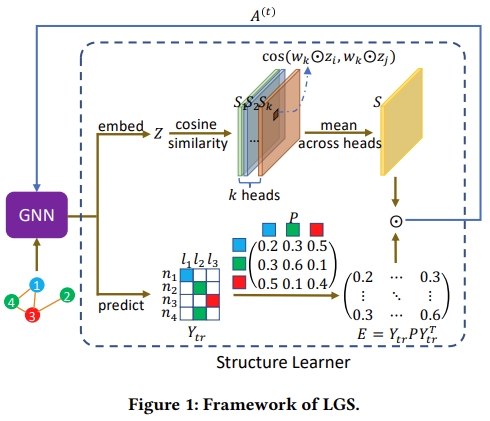

# LGCF


This is the code for the CIKM 2021 Paper: [Label-informed Graph Structure Learning for Node Classification](https://dl.acm.org/doi/abs/10.1145/3459637.3482129).

## Usage


## Requirements


## Citation

Please cite our paper if you use the code:
```
@inproceedings{10.1145/3459637.3482129,
author = {Wang, Liping and Hu, Fenyu and Wu, Shu and Wang, Liang},
title = {Label-informed Graph Structure Learning for Node Classification},
year = {2021},
isbn = {9781450384469},
publisher = {Association for Computing Machinery},
address = {New York, NY, USA},
url = {https://doi.org/10.1145/3459637.3482129},
doi = {10.1145/3459637.3482129},
abstract = {Graph Neural Networks (GNNs) have achieved great success among various domains. Nevertheless, most GNN methods are sensitive to the quality of graph structures. To tackle this problem, some studies exploit different graph structure learning strategies to refine the original graph structure. However, these methods only consider feature information while ignoring available label information. In this paper, we propose a novel label-informed graph structure learning framework which incorporates label information explicitly through a class transition matrix. We conduct extensive experiments on seven node classification benchmark datasets and the results show that our method outperforms or matches the state-of-the-art baselines.},
booktitle = {Proceedings of the 30th ACM International Conference on Information \& Knowledge Management},
pages = {3488–3492},
numpages = {5},
keywords = {structure learning, node classification, graph neural network},
location = {Virtual Event, Queensland, Australia},
series = {CIKM '21}
}
```
